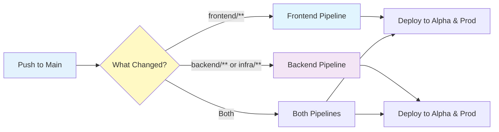
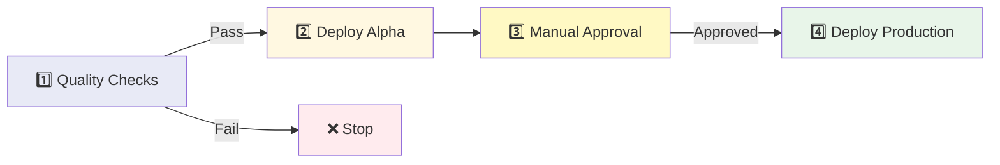
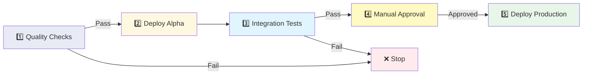
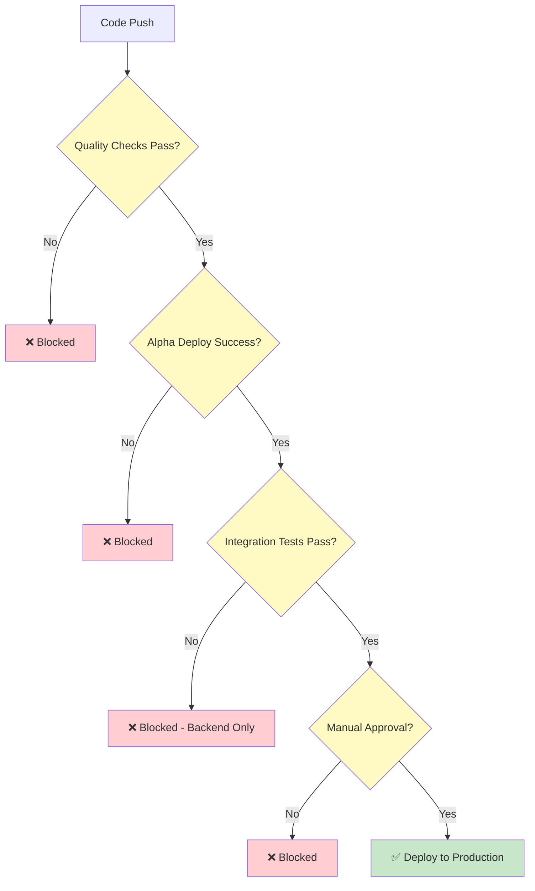

# RoleReady CI/CD Pipeline

Simple, visual guide to our deployment pipelines.

---

## 🎯 Quick Overview

We have **2 independent pipelines** that run in parallel:



---

## 🎨 Frontend Pipeline

**Simple 4-step process:**



### Stage Details

| Stage | What Happens | Duration |
|-------|-------------|----------|
| **1️⃣ Quality Checks** | • ESLint<br>• TypeScript check<br>• Trivy security scan | ~2 min |
| **2️⃣ Deploy Alpha** | • Build React app (alpha config)<br>• Upload to S3 | ~3 min |
| **3️⃣ Manual Approval** | GitHub environment gate | ⏸️ Manual |
| **4️⃣ Deploy Production** | • Build React app (prod config)<br>• Upload to S3 | ~2 min |

**Total Time:** ~7 minutes + manual approval

---

## 🔧 Backend & Infrastructure Pipeline

**Simple 6-step process:**



### Stage Details

| Stage | What Happens | Duration |
|-------|-------------|----------|
| **1️⃣ Quality Checks** | **Backend Tests:**<br>• Python formatting (black)<br>• Linting (flake8)<br>• Unit tests (pytest)<br>**CDK Check:**<br>• TypeScript checks<br>• CDK synth<br>• Trivy security scan | ~5 min |
| **2️⃣ Deploy Alpha** | • CDK deploy to Alpha AWS<br>• Update Lambda, API Gateway, DynamoDB | ~4 min |
| **3️⃣ Integration Tests** | • Test deployed API endpoints<br>• Verify functionality | ~2 min |
| **4️⃣ Manual Approval** | GitHub environment gate | ⏸️ Manual |
| **5️⃣ Deploy Production** | • CDK deploy to Prod AWS<br>• Update all infrastructure | ~4 min |

**Total Time:** ~15 minutes + manual approval

---

## 🌍 Environments

| Environment | AWS Account | URL |
|-------------|-------------|-----|
| **Alpha** (Testing) | 265870078323 | https://alpha.apaps.people.aws.dev |
| **Production** | 431081169070 | https://apaps.people.aws.dev |

---

## 🔐 Security & Quality Gates

### What Blocks Deployment?



### Security Checks (Every Build)

- ✅ **Trivy Vulnerability Scan** - Blocks on CRITICAL/HIGH
- ✅ **Code Quality** - ESLint, flake8, TypeScript
- ✅ **Unit Tests** - Backend pytest suite
- ✅ **Integration Tests** - Alpha API validation (backend only)
- ✅ **Manual Review** - Production requires approval

---

## 📊 Pipeline Comparison

### When Frontend Changes

```
Push → Quality Checks (2m) → Alpha Deploy (3m) → [Approval] → Prod Deploy (2m)
Total: ~7 minutes + approval time
```

### When Backend Changes

```
Push → Quality Checks (5m) → Alpha Deploy (4m) → Tests (2m) → [Approval] → Prod Deploy (4m)
Total: ~15 minutes + approval time
```

### When Both Change (Parallel Execution)

```
Frontend: Push → [7 min pipeline]  → [Approval] → Prod
Backend:  Push → [15 min pipeline] → [Approval] → Prod

Total: ~15 minutes (max of both) + approval time
```

---

## 🚀 How to Deploy

### Automatic Deployment

```bash
# 1. Make changes
git add .
git commit -m "feat: your changes"

# 2. Push to main
git push origin main

# 3. Watch GitHub Actions
# - Open GitHub → Actions tab
# - See pipeline run automatically

# 4. Approve production (when ready)
# - Go to Actions → Click running workflow
# - Click "Review deployments" → Approve
```

### What Triggers Each Pipeline?

| Files Changed | Pipeline Triggered |
|---------------|-------------------|
| `frontend/**` | Frontend only |
| `backend/**` | Backend only |
| `infrastructure/**` | Backend only |
| `package.json` | Both |
| `.github/workflows/**` | Both |

---

## 🎯 Common Scenarios

### Scenario 1: Frontend Bug Fix

```
1. Fix React component
2. Push to main
3. Frontend pipeline runs (~7 min)
4. Approve for production
5. ✅ Done - Backend not affected
```

### Scenario 2: Backend API Update

```
1. Update Lambda function
2. Push to main
3. Backend pipeline runs (~15 min)
4. Integration tests validate changes
5. Approve for production
6. ✅ Done - Frontend not affected
```

### Scenario 3: Breaking API Change

```
1. Update backend API contract
2. Update frontend to match
3. Push to main
4. Both pipelines run in parallel (~15 min)
5. Test alpha environment manually
6. Approve backend first
7. Approve frontend second
8. ✅ Done - Coordinated release
```

---

## 🔧 Troubleshooting

### Build Fails at Quality Checks

**Frontend:**
- Fix ESLint errors: `cd frontend && npm run lint -- --fix`
- Fix TypeScript: Check error messages in Actions log
- Trivy failures: Update vulnerable packages

**Backend:**
- Fix formatting: `cd backend && make format`
- Fix linting: `cd backend && make lint`
- Fix tests: `cd backend && make test`

### Deployment Fails

**Check CloudFormation:**
```bash
aws cloudformation describe-stack-events \
  --stack-name ServiceStack \
  --region eu-west-1 \
  --max-items 20
```

**Common Issues:**
- Stack doesn't exist yet → Deploy infrastructure first
- IAM permission error → Check GitHub Actions role
- Resource conflict → Check if resource already exists

### Integration Tests Fail

**Alpha environment issues:**
```bash
# Test API manually
curl https://api.alpha.apaps.people.aws.dev/health

# Check Lambda logs
aws logs tail /aws/lambda/YourFunctionName --follow
```

---

## 📈 Performance Metrics

### Recent Optimizations

✅ **Removed duplicate quality checks** (Feb 2026)
- Before: 9 minutes
- After: 7 minutes
- Savings: 22% faster

### Current Performance

| Pipeline | Target | Actual |
|----------|--------|--------|
| Frontend | < 8 min | ~7 min ✅ |
| Backend | < 20 min | ~15 min ✅ |

---

## 🎓 Pipeline Best Practices

### ✅ Do's

- ✅ Let pipelines run on every push to main
- ✅ Fix quality check failures immediately
- ✅ Test in alpha before approving production
- ✅ Use meaningful commit messages (triggers right pipeline)
- ✅ Deploy backend before frontend for API changes

### ❌ Don'ts

- ❌ Skip quality checks
- ❌ Approve production without testing alpha
- ❌ Deploy during peak hours (use manual approval timing)
- ❌ Push broken code to main (use feature branches)

---

## 📚 Related Documentation

- [README](../README.md) - Project overview
- [Technical Documentation](../TECHNICAL_DOCUMENTATION.md) - Architecture details
- [GitHub Actions Workflows](../.github/workflows/) - Pipeline source code

---

*Last Updated: 2026-02-19*
*Pipeline Version: v2.0 (Optimized)*
