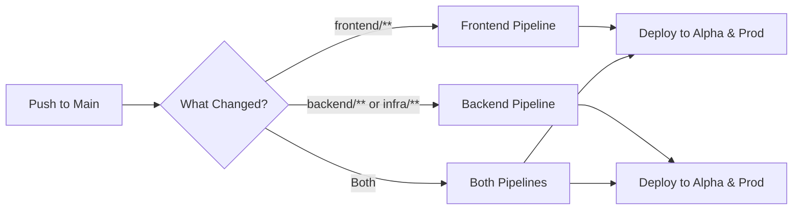
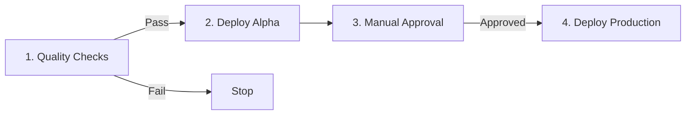
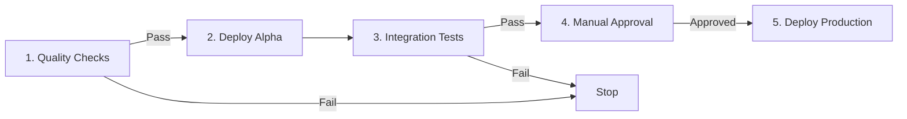
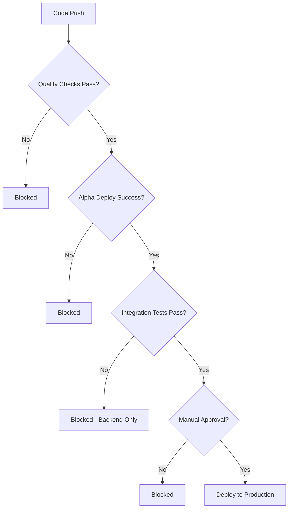

# RoleReady CI/CD Pipeline

Visual guide to our deployment pipelines.

---

## Quick Overview

We have **2 independent pipelines** that run in parallel:

---

## Frontend Pipeline

**4-step process:**

### Stage Details

| Stage | What Happens | Duration |
|-------|-------------|----------|
| **1. Quality Checks** | ESLint TypeScript check Trivy security scan | ~2 min |
| **2. Deploy Alpha** | Build React app (alpha config) Upload to S3 | ~3 min |
| **3. Manual Approval** | GitHub environment gate | Manual |
| **4. Deploy Production** | Build React app (prod config) Upload to S3 | ~2 min |

**Total Time:** ~7 minutes + manual approval

---

## Backend & Infrastructure Pipeline

**5-step process:**

### Stage Details

| Stage | What Happens | Duration |
|-------|-------------|----------|
| **1. Quality Checks** | **Backend Tests:** Python formatting (black) Linting (flake8) Unit tests (pytest) **CDK Check:** TypeScript checks CDK synth Trivy security scan | ~5 min |
| **2. Deploy Alpha** | CDK deploy to Alpha AWS Update Lambda, API Gateway, DynamoDB | ~4 min |
| **3. Integration Tests** | Test deployed API endpoints Verify functionality | ~2 min |
| **4. Manual Approval** | GitHub environment gate | Manual |
| **5. Deploy Production** | CDK deploy to Prod AWS Update all infrastructure | ~4 min |

**Total Time:** ~15 minutes + manual approval

---

## Environments

| Environment | AWS Account | URL |
|-------------|-------------|-----|
| **Alpha** (Testing) | 265870078323 | https://alpha.apaps.people.aws.dev |
| **Production** | 431081169070 | https://apaps.people.aws.dev |

---

## Security & Quality Gates

### What Blocks Deployment?

### Security Checks (Every Build)

- **Trivy Vulnerability Scan** - Blocks on CRITICAL/HIGH
- **Code Quality** - ESLint, flake8, TypeScript
- **Unit Tests** - Backend pytest suite
- **Integration Tests** - Alpha API validation (backend only)
- **Manual Review** - Production requires approval

---

## Automated Maintenance

### Dependabot

Automated dependency management runs weekly to keep the project secure:

- **Weekly Scans**: Checks Python (pip), npm, and GitHub Actions for updates
- **Security Patches**: Automatically creates PRs for vulnerability fixes
- **Version Updates**: Proposes updates for outdated dependencies
- **Review Process**: All updates go through PR review before merging

Configuration: [`.github/dependabot.yml`](../.github/dependabot.yml)

---

## Pipeline Triggers

| Files Changed | Pipeline Triggered |
|---------------|-------------------|
| `frontend/**` | Frontend only |
| `backend/**` | Backend only |
| `infrastructure/**` | Backend only |
| `package.json` | Both |
| `.github/workflows/**` | Both |

---

## Related Documentation

- [README](../README.md) - Project overview
- [Technical Documentation](../TECHNICAL_DOCUMENTATION.md) - Architecture details
- [GitHub Actions Workflows](../.github/workflows/) - Pipeline source code

---

*Last Updated: 2026-02-22*
