# RoleReady CI/CD Pipeline

This document visualizes the CI/CD pipeline architecture for the RoleReady project.

## Pipeline Overview

The project uses two parallel GitHub Actions workflows:
1. **Frontend Pipeline** - Deploys React application to S3/CloudFront
2. **Infrastructure & Backend Pipeline** - Deploys CDK stacks and Lambda functions

---

## Frontend Pipeline Flow


---

## Infrastructure & Backend Pipeline Flow

```mermaid
graph TB
    subgraph "Infrastructure & Backend Deploy Pipeline"
        A[Push to Main<br/>infrastructure/** or backend/** changes] --> B[Backend Tests Job]
        A --> C[CDK Check Job]

        subgraph "Backend Tests"
            B --> B1[Checkout Code]
            B1 --> B2[Setup Python 3.11]
            B2 --> B3[Install Requirements]
            B3 --> B4[Run Make Build<br/>black, flake8, pytest]
            B4 --> B5[Trivy Security Scan<br/>All Dependencies]
        end

        subgraph "CDK Check"
            C --> C1[Checkout Code]
            C1 --> C2[Setup Node.js 20]
            C2 --> C3[Install Dependencies]
            C3 --> C4[Run Infrastructure Tests]
            C4 --> C5[TypeScript Type Check]
            C5 --> C6[CDK Synth]
        end

        B5 -->|Pass| D{Both Jobs Pass?}
        C6 -->|Pass| D
        B5 -->|Fail| X1[❌ Build Failed]
        C6 -->|Fail| X1

        D -->|Yes| E[Deploy to Alpha]
        D -->|No| X1

        subgraph "Alpha Deployment"
            E --> E1[Configure AWS Credentials<br/>Alpha Account 265870078323]
            E1 --> E2[CDK Deploy<br/>--require-approval never]
            E2 --> E3[CloudFormation Stack Update<br/>Lambda, API Gateway, DynamoDB, etc.]
        end

        E3 --> F[Integration Tests on Alpha]

        subgraph "Alpha Integration Tests"
            F --> F1[Get API URL from CloudFormation]
            F1 --> F2[Run pytest integration tests<br/>tests/test_alpha_integration.py]
        end

        F2 -->|Pass| G{Manual Approval Required<br/>Production Environment}
        F2 -->|Fail| X2[❌ Integration Tests Failed]

        G -->|Approved| H[Deploy to Production]
        G -->|Rejected| X3[❌ Deployment Cancelled]

        subgraph "Production Deployment"
            H --> H1[Configure AWS Credentials<br/>Prod Account 431081169070]
            H1 --> H2[CDK Deploy<br/>--require-approval never]
            H2 --> H3[CloudFormation Stack Update<br/>Production Resources]
        end

        H3 --> I[✅ Production Deployed<br/>https://api.apaps.people.aws.dev]
    end

    style A fill:#e1f5ff
    style D fill:#fff9c4
    style E fill:#fff4e6
    style H fill:#ffe6e6
    style I fill:#e8f5e9
    style X1 fill:#ffebee
    style X2 fill:#ffebee
    style X3 fill:#ffebee
    style B5 fill:#f3e5f5
    style G fill:#fff9c4
```



---

## Combined Pipeline Architecture

```mermaid
graph LR
    subgraph "Developer Workflow"
        A[Developer Push to Main] --> B{Changed Files?}
    end

    subgraph "Parallel Pipelines"
        B -->|frontend/**| C[Frontend Pipeline]
        B -->|backend/** or infrastructure/**| D[Backend & Infra Pipeline]
        B -->|Both| E[Both Pipelines Trigger]
    end

    subgraph "Frontend Flow"
        C --> C1[Lint & Type Check]
        C1 --> C2[Trivy Scan]
        C2 --> C3[Deploy Alpha]
        C3 --> C4[Manual Approval]
        C4 --> C5[Deploy Prod]
    end

    subgraph "Backend & Infra Flow"
        D --> D1[Backend Tests]
        D --> D2[CDK Check]
        D1 --> D3[Deploy Alpha]
        D2 --> D3
        D3 --> D4[Integration Tests]
        D4 --> D5[Manual Approval]
        D5 --> D6[Deploy Prod]
    end

    E --> C
    E --> D

    C5 --> F[✅ Frontend Live]
    D6 --> G[✅ Backend Live]

    F --> H[🚀 RoleReady Fully Deployed]
    G --> H

    style A fill:#e1f5ff
    style B fill:#fff9c4
    style C4 fill:#fff9c4
    style D5 fill:#fff9c4
    style H fill:#c8e6c9
```



---

## Pipeline Stages Explained

### 🔵 Frontend Pipeline
1. **Quality Checks** (runs once) - ESLint + TypeScript + Trivy vulnerability scanning
2. **Alpha Deploy** - Build with alpha configs → Deploy to S3
3. **Manual Gate** - GitHub Environment protection
4. **Prod Deploy** - Build with production configs → Deploy to S3 (no duplicate checks!)

**⚡ Performance Optimization**: Quality checks run once and gate both deployments, saving ~2 minutes per deployment!

### 🟢 Backend & Infrastructure Pipeline
1. **Backend Tests** - Python formatting, linting, unit tests
2. **CDK Check** - TypeScript checks + CDK synth validation
3. **Security** - Trivy vulnerability scanning (all dependencies)
4. **Alpha Deploy** - CDK deploy to alpha AWS account
5. **Integration Tests** - Verify alpha deployment works
6. **Manual Gate** - GitHub Environment protection
7. **Prod Deploy** - CDK deploy to production AWS account

---

## Environment Details

| Environment | AWS Account | Region | URL |
|-------------|-------------|--------|-----|
| **Alpha** | 265870078323 | eu-west-1 | https://alpha.apaps.people.aws.dev |
| **Production** | 431081169070 | eu-west-1 | https://apaps.people.aws.dev |

---

## Security Gates

- ✅ **Trivy Vulnerability Scanning** on every build
- ✅ **Manual approval** required for production deployments
- ✅ **Integration tests** must pass in alpha before prod
- ✅ **AWS IAM roles** with least privilege (no long-term credentials)
- ✅ **Separate AWS accounts** for alpha and production

---

## Key Features

- 🔄 **Parallel Pipelines** - Frontend and backend deploy independently
- 🛡️ **Security First** - Trivy scans block builds with critical vulnerabilities
- 🧪 **Test Before Prod** - Integration tests validate alpha before production
- 🔐 **Manual Gates** - Production requires explicit approval
- 🚀 **Zero Downtime** - CloudFront and API Gateway handle deployments seamlessly
- 📊 **CloudFormation** - Infrastructure as Code with full rollback capability

---

## Triggering Pipelines

### Frontend Pipeline Triggers
```bash
git push origin main
# Modified files: frontend/**, package.json, or .github/workflows/**
```

### Backend & Infrastructure Pipeline Triggers
```bash
git push origin main
# Modified files: backend/**, infrastructure/**, package.json, or .github/workflows/**
```

### Both Pipelines Trigger
```bash
git push origin main
# Modified files: Any combination of the above
```

---

## Deployment Flow Diagram


---

## Monitoring & Rollback

- **CloudFormation Stack Status**: Monitor via AWS Console or CLI
- **CloudWatch Alarms**: Automatic alerts on Lambda errors
- **Rollback**: Use CloudFormation rollback or redeploy previous commit
- **Logs**: CloudWatch Logs for Lambda functions and API Gateway

---

## Troubleshooting

### Build Failures
- Check GitHub Actions logs for specific error
- Trivy scan failures: Update vulnerable dependencies
- Test failures: Fix code and re-push

### Deployment Failures
- Check CloudFormation events in AWS Console
- Verify IAM role permissions
- Check stack outputs are present

### Manual Approval Stuck
- Ensure reviewer has GitHub access to the repository
- Check Environment protection rules in repo settings

---

*Last Updated: 2026-02-19*
